# WGRALGO Generational Wealth Roadmap

Generational Wealth Roadmap is a free educational Android app from
**The Wealth Gap Resolution Algorithm&trade; Inc.** It helps users explore how
budgeting, credit, education, housing, investing, emergency planning, and
family decisions can shape a long-term wealth story.

Live a whole financial life, from 18 to your legacy years. Make real-world
money decisions, handle life's surprises, and watch how your choices grow (or
drain) your family's wealth over decades.

The app is offline-first, free, ad-free, and tracker-free.

- Version: **2.0.0**
- Devices: phones and tablets, portrait and landscape
- Package: `org.wgralgo.generationalwealthroadmap`
- License: **GNU General Public License v3.0 or later**
- Owner / Publisher: WGRALGO &mdash; The Wealth Gap Resolution Algorithm&trade; Inc.
- Concept page: https://thewealthgapresolutionalgorithm.org/generational-wealth-roadmap/

## Features

- **Three starting points at 18:** First-Gen Student, Trades Apprentice, or
  Young Parent, each with its own first decision.
- **10 decisions across 5 life stages**, from the launchpad years to your
  legacy years, drawn from 42 decisions including 12 surprise life events.
  Every playthrough is different.
- **A real money model (simplified):** investments grow about 7% a year,
  credit cards cost about 22%, loans are paid off over time, and surprise
  costs come from savings first, then the credit card.
- **Dashboard** of age, net worth, investments, savings, debt, home equity,
  interest paid, and family protections, updated as the years pass.
- Feedback after every choice, with the strongest move and what it changed.
- **Family Wealth Score** out of 100, your finances at 65, how much is likely
  to reach the next generation, a family protection checklist, the power of
  starting early, and a review of every decision.
- **Looks like a real app:** black launch screen with the big logo, a launcher
  icon that fills round, squircle, and square shapes, a solid app bar,
  About / Privacy / Credits panels, and Android back-button support (back
  asks before leaving a roadmap, returns to the start from results, and asks
  before exiting the app).
- **Phones and tablets, portrait and landscape:** the app rotates freely. On
  phones turned sideways the start-screen logo is smaller so the game starts
  on screen; on tablets the dashboard spreads into four columns.
- Fully offline &mdash; no `INTERNET` permission, no ads, no analytics, no trackers.

## Screenshots

| Launch | Home | Decision | Feedback |
|---|---|---|---|
| 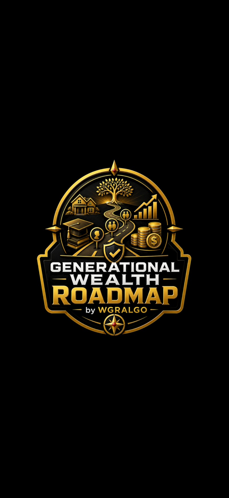 | 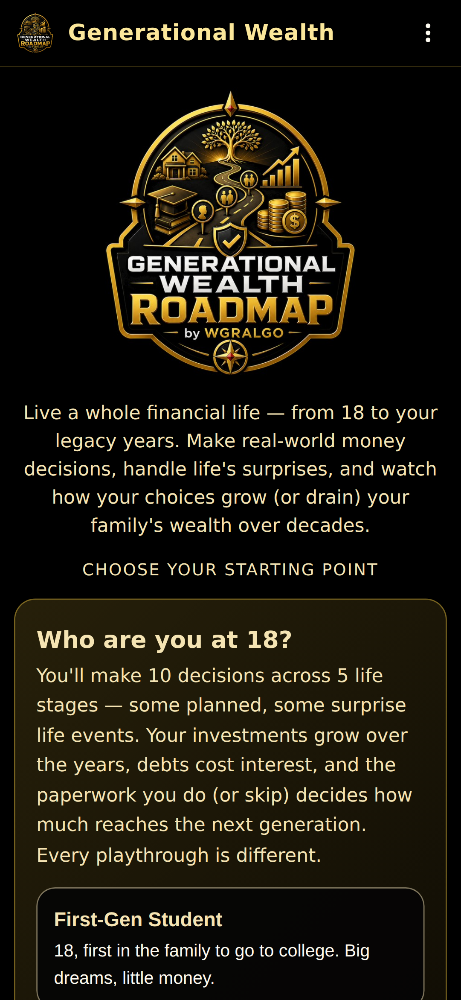 | 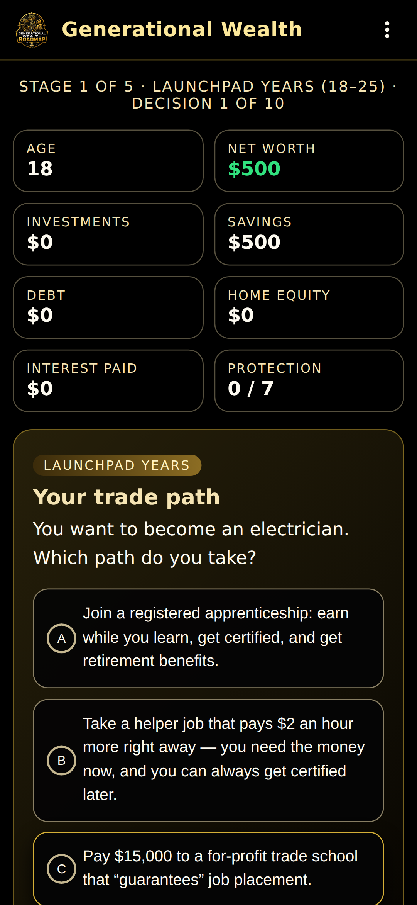 | 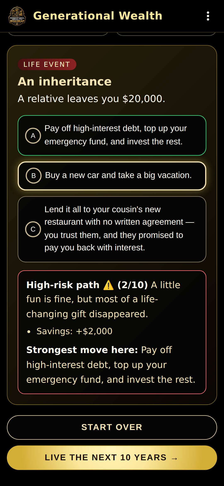 |

| Next life stage | Results | Menu | About |
|---|---|---|---|
| 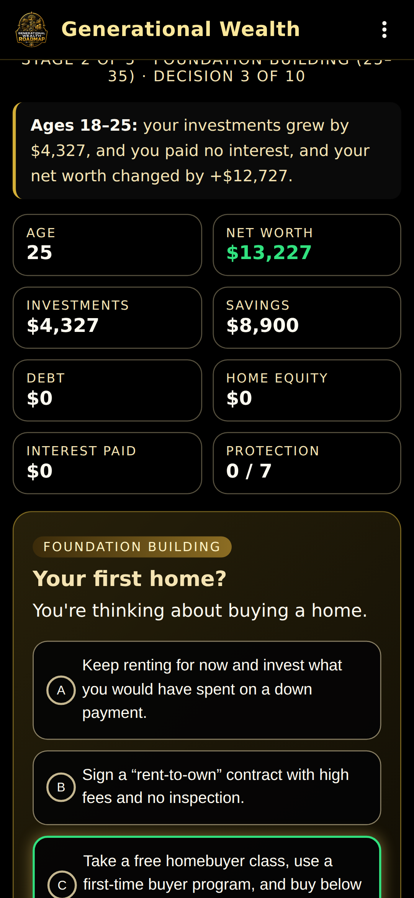 | 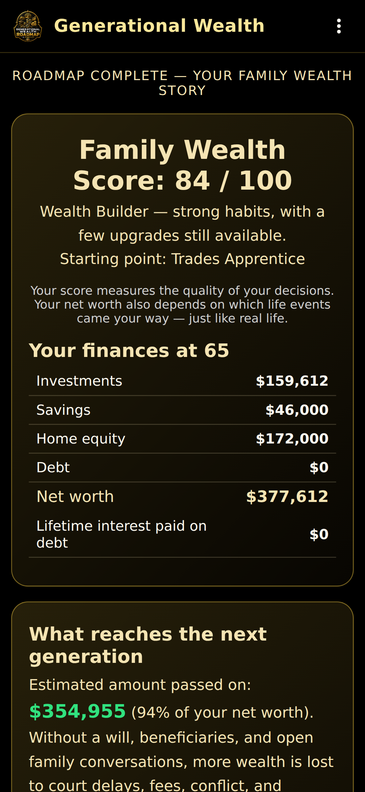 | 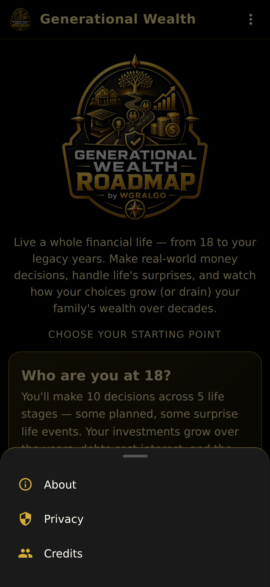 | 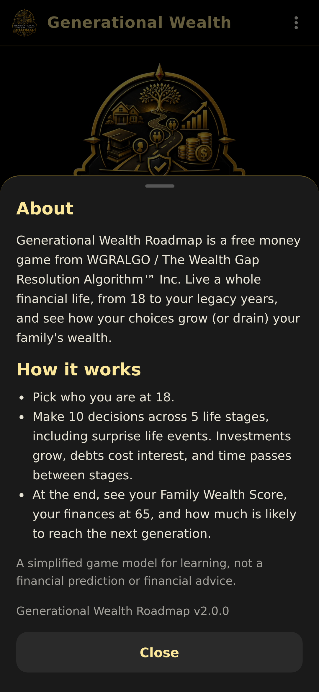 |

Phones and tablets:

| Phone, landscape | Tablet, landscape | Tablet, portrait |
|---|---|---|
| 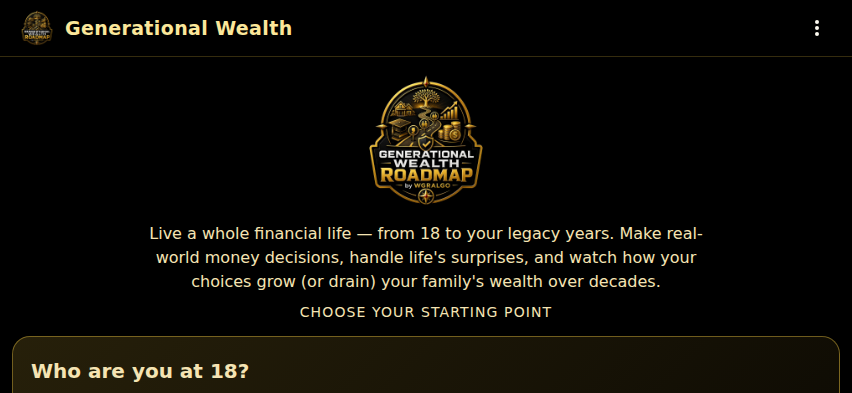 | 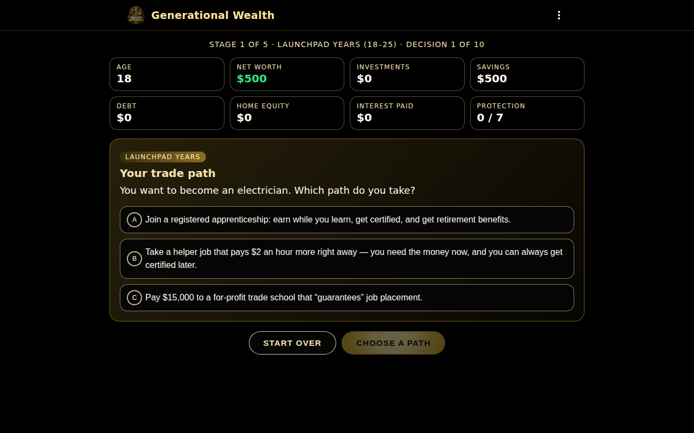 | 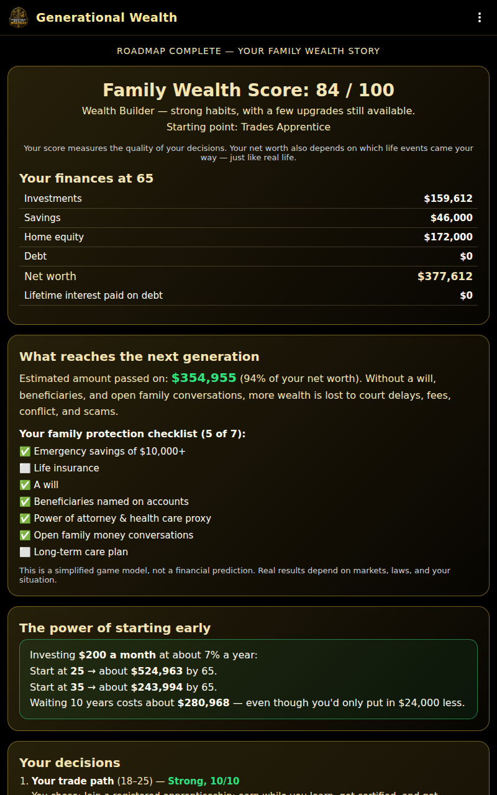 |

## Install / sideload the APK

1. Download `WGRALGO-GenerationalWealthRoadmap-v2.0.0.apk` from the
   [latest release](../../releases/latest).
2. On your Android phone or tablet, allow installs from unknown sources for
   your browser or file manager.
3. Open the APK file on the device and confirm install.
4. Optionally verify the SHA-256 of the APK matches
   `WGRALGO-GenerationalWealthRoadmap-v2.0.0.apk.sha256` before installing.

> **Upgrading from v1.0.0?** Version 2.0.0 is signed with a new key, so it
> can't install over the old app. Uninstall v1.0.0 first, then install v2.0.0.
> The app saves nothing on your device, so nothing is lost.

### Signing certificate (v2.0.0 and later)

- `CN=WGRALGO, OU=Generational Wealth Roadmap, O=The Wealth Gap Resolution Algorithm Inc, C=US`
- SHA-256: `F6:9B:24:61:00:99:7D:E2:02:FF:4E:8D:DF:D3:8B:25:B0:9E:79:01:99:CA:DD:84:B4:A0:C2:87:99:15:2C:69`

```bash
apksigner verify --print-certs WGRALGO-GenerationalWealthRoadmap-v2.0.0.apk
```

## Build from source

This is a Capacitor 6 app with a vanilla HTML / CSS / JS frontend in `www/`.

```bash
# Web assets are pre-built; just sync into the Android project
npm install
npx cap sync android

# Then build the Android APK
cd android
./gradlew assembleRelease
# Output: android/app/build/outputs/apk/release/app-release.apk
```

### Release signing

Release builds expect a `android/keystore.properties` file (NEVER committed)
or environment variables:

```
GWR_KEYSTORE_FILE=/absolute/path/to/your-release.jks
GWR_KEYSTORE_PASSWORD=...
GWR_KEY_ALIAS=...
GWR_KEY_PASSWORD=...
```

Or a `keystore.properties` file in `android/` with the same keys:

```
storeFile=/absolute/path/to/your-release.jks
storePassword=...
keyAlias=generational-wealth
keyPassword=...
```

### Icons and splash

Launcher icons, the Android 12+ system splash, the legacy splash images, and
the in-app logo are all generated from `assets/icon.png` by
`tools/build-icons.py`: the big logo on solid black, sized to stay inside
round, squircle, and square icon masks. To rebuild, from the repo root:

```bash
python3 tools/build-icons.py
```

Check a build before publishing:

```bash
bash tools/validate-release.sh android/app/build/outputs/apk/release/app-release.apk
```

## Continuous integration and releases

- [`.github/workflows/android.yml`](.github/workflows/android.yml) builds a
  debug APK on every push and pull request.
- [`.github/workflows/release.yml`](.github/workflows/release.yml) builds,
  validates, signs, and publishes `WGRALGO-GenerationalWealthRoadmap-v<version>.apk`
  with its `.sha256` to GitHub Releases. Run it from the **Actions** tab or
  push a `v*` tag. It needs these repository secrets: `GWR_KEYSTORE_BASE64`,
  `GWR_KEYSTORE_PASSWORD`, `GWR_KEY_ALIAS`, `GWR_KEY_PASSWORD`.

## Privacy summary

- No account required
- No ads, no analytics, no trackers
- No data selling, no cloud upload
- No personal financial data is collected
- No answers, scores, or decisions are sent to WGRALGO or anywhere else
- The APK does NOT declare the `INTERNET` permission

See [PRIVACY.md](PRIVACY.md) for details.

## Educational disclaimer

Generational Wealth Roadmap is for **educational awareness only**. It does
not provide legal, financial, tax, investment, estate planning, credit,
lending, or professional advice. The choices and outcomes are simplified
learning examples. Individual situations are different. For personal
financial decisions, consult a qualified professional.

## License

This project is released under the **GNU General Public License v3.0**.
See [LICENSE](LICENSE) for the full license text.

## Contributors

See [CONTRIBUTORS.md](CONTRIBUTORS.md).
