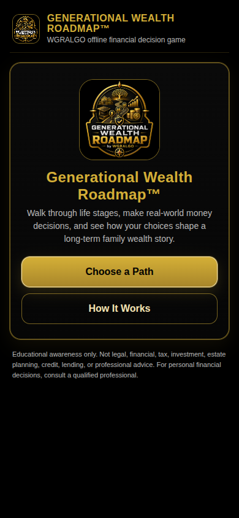
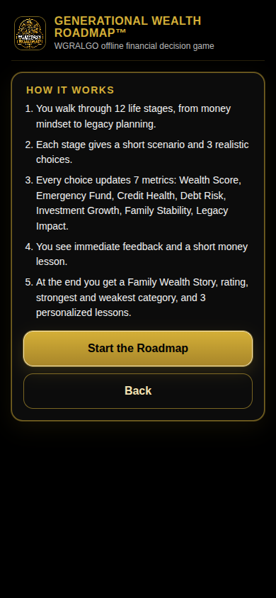
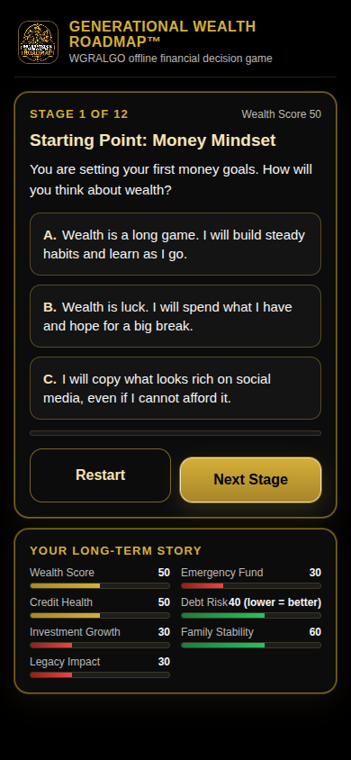
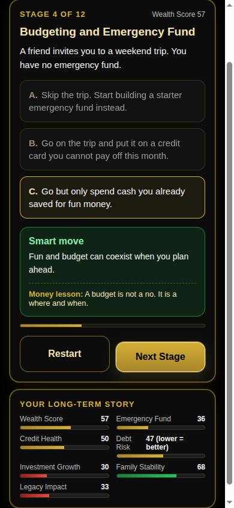

# WGRALGO Generational Wealth Roadmap

Generational Wealth Roadmap is a free educational Android app from
**The Wealth Gap Resolution Algorithm&trade; Inc.** It helps users explore how
budgeting, credit, education, housing, investing, emergency planning, and
family decisions can shape a long-term wealth story.

Players walk through 12 life stages, make realistic money choices, watch
seven simple metrics shift, and finish with a Family Wealth Story summary
and personalized lessons.

The app is offline-first, free, ad-free, and tracker-free.

- Version: **1.0.0**
- Package: `org.wgralgo.generationalwealthroadmap`
- License: **GNU General Public License v3.0**
- Owner / Publisher: WGRALGO &mdash; The Wealth Gap Resolution Algorithm&trade; Inc.
- Concept page: https://thewealthgapresolutionalgorithm.org/generational-wealth-roadmap/

## Features

- 12 life-stage decision cards, 36 realistic choices in total
- 7 long-term metrics tracked across every stage:
  - Wealth Score
  - Emergency Fund
  - Credit Health
  - Debt Risk
  - Investment Growth
  - Family Stability
  - Legacy Impact
- Immediate feedback plus a short money lesson after every choice
- Final Family Wealth Story summary with rating, strongest area, weakest area,
  and three personalized lessons
- Ratings: Legacy Builder, Wealth Strategist, Foundation Builder, Still
  Building, Restart the Roadmap
- Play Again resets the round
- Black-and-gold WGRALGO design language
- Phone and tablet responsive layout
- Fully offline &mdash; no `INTERNET` permission, no ads, no analytics, no trackers

## Screenshots

| Home | How It Works | Roadmap |
|---|---|---|
|  |  |  |

| Choice Feedback | Metrics | Results |
|---|---|---|
|  |  |  |

## Install / sideload the APK

1. Download `GenerationalWealthRoadmap-v1.0.0.apk` from the
   [latest release](../../releases/latest).
2. On your Android phone, allow installs from unknown sources for your
   browser or file manager.
3. Open the APK file on the device and confirm install.
4. Optionally verify the SHA-256 of the APK matches
   `GenerationalWealthRoadmap-v1.0.0.apk.sha256` before installing.

## Build from source

This is a Capacitor 6 app with a vanilla HTML / CSS / JS frontend in `www/`.

```bash
# Web assets are pre-built; just sync into the Android project
npm install
npx cap sync android

# Then build the Android APK
cd android
./gradlew assembleRelease
# Output: android/app/build/outputs/apk/release/app-release.apk
```

### Release signing

Release builds expect a `android/keystore.properties` file (NEVER committed)
or environment variables:

```
GWR_KEYSTORE_FILE=/absolute/path/to/your-release.jks
GWR_KEYSTORE_PASSWORD=...
GWR_KEY_ALIAS=...
GWR_KEY_PASSWORD=...
```

Or a `keystore.properties` file in `android/` with the same keys:

```
storeFile=/absolute/path/to/your-release.jks
storePassword=...
keyAlias=gwr-release
keyPassword=...
```

### Icons and splash

Launcher icons and splash screens are generated from a single source logo by
`tools/build-icons.py`. It writes full-bleed adaptive icons (no white square)
and a black-background splash. To rebuild:

```bash
python3 tools/build-icons.py
```

## Privacy summary

- No account required
- No ads, no analytics, no trackers
- No data selling, no cloud upload
- No personal financial data is collected
- No answers, scores, or decisions are sent to WGRALGO or anywhere else
- The APK does NOT declare the `INTERNET` permission

See [PRIVACY.md](PRIVACY.md) for details.

## Educational disclaimer

Generational Wealth Roadmap is for **educational awareness only**. It does
not provide legal, financial, tax, investment, estate planning, credit,
lending, or professional advice. The choices and outcomes are simplified
learning examples. Individual situations are different. For personal
financial decisions, consult a qualified professional.

## License

This project is released under the **GNU General Public License v3.0**.
See [LICENSE](LICENSE) for the full license text.

## Contributors

See [CONTRIBUTORS.md](CONTRIBUTORS.md).
